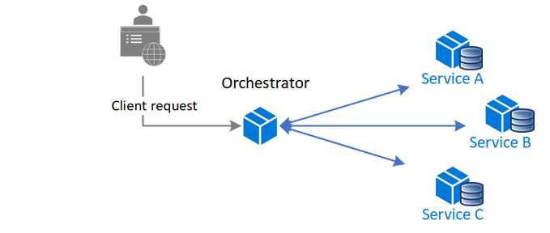

# Node sagas 
This is a repository for the `node-sagas-orchestrator` package.
`node-sagas-orchestrator` is a convenient library for managing data consistency in a microservice architecture.
It helps create distributed transaction across services.

## Pattern
This follows the **orchestrator** pattern, saga comes in different forms, this can be considered the simplest in-terms of infrastructure needed and code.
You have your main component the orchestrator which handles the flow of the distributed transaction, it kicks of the chain of **steps** taken in the transactions
and incase of failure it runs the compensations to return to a valid state.



## Installing / Getting started

This module is installed via npm::

```shell
npm i --save node-sagas-orchestrator
```

## Example

This package provides you with main classes for creating sagas.
The first main class is `SagaBuilder`. 
```typescript
  import { SagaBuilder } from 'node-sagas';
  
  const sagaBuilder = new SagaBuilder();
  const saga = sagaBuilder
    .step('Create order')
    .invoke(() => {
      // create order logic
    })
    .withCompensation(() => {
      // reject order logic
    })
    .step('Reserve credit')
    .invoke(() => {
      // reserve credit
    })
    .step('Approve order')
    .invoke(() => {
      // approve order
    })
    .build();

    try {
      return await saga.execute();
    } catch (e) {
      if (e instanceof SagaExecutionFailed) {
        // Throws, when invocation flow was failed, but compensation has been completed
      }
      if (e instanceof SagaCompensationFailed) {
        // Throws, when compensation flow was failed
      }
    }
```

A step could be defined using `step()` method, for each step you can set an action for a positive 
case with `invoke()` method. Also for each step, you can define compensation action with `withCompensation()` method.

## Licensing

The code in this project is licensed under MIT license.

## References 
- Kudos to the [originial repo](https://github.com/SlavaPanevskiy/node-sagas) 